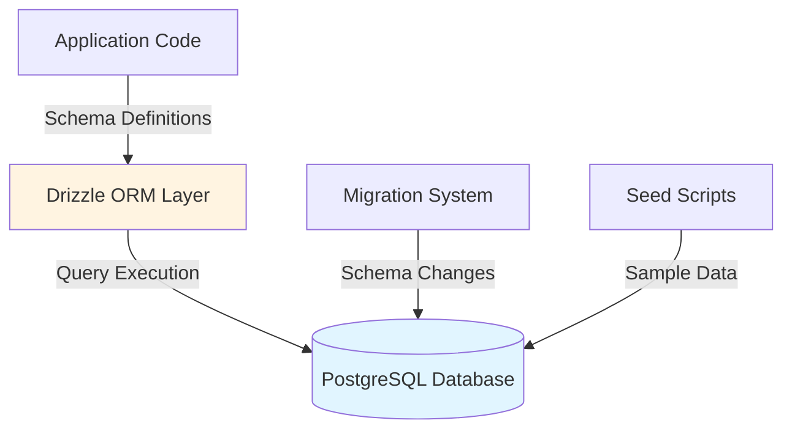
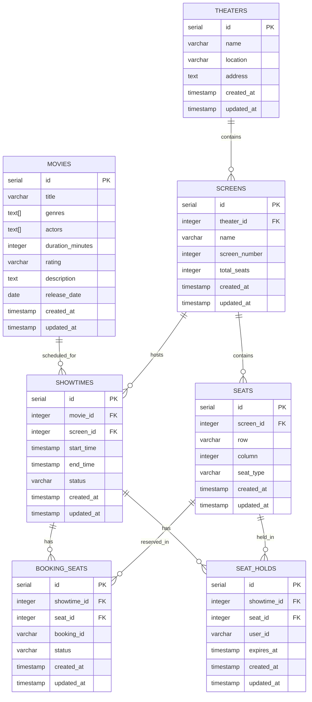

# Design Document: Data Modeling Milestone

## Overview

This milestone establishes the foundational data layer for a movie reservation system using Drizzle ORM with PostgreSQL. The design focuses exclusively on:

1. **Database Configuration**: Setting up Drizzle ORM with PostgreSQL connection and migration tooling
2. **Schema Design**: Creating seven core tables with proper relationships, constraints, and data types
3. **Migration Management**: Configuring Drizzle Kit to generate and apply schema migrations
4. **Data Seeding**: Creating sample data to verify relationships and constraints

**Key Design Principles:**
- **Type Safety**: Leverage TypeScript and Drizzle's type-safe schema definitions
- **Referential Integrity**: Use foreign keys with appropriate cascade/restrict behaviors
- **Data Consistency**: Apply unique constraints to prevent duplicate reservations
- **Domain Organization**: Structure schemas by business domain (theaters, movies, showtimes, bookings)

**Out of Scope for This Milestone:**
- Business logic and API endpoints
- Authentication and authorization
- Payment processing
- Real-time seat availability updates

## Architecture

### Technology Stack

- **Database**: PostgreSQL (relational database for structured data with strong consistency)
- **ORM**: Drizzle ORM (lightweight, type-safe ORM with excellent TypeScript integration)
- **Migration Tool**: Drizzle Kit (schema-to-migration generator)
- **Runtime**: Node.js with TypeScript
- **Database Driver**: `postgres` or `pg` (PostgreSQL client library)

### System Context



### Directory Structure

```
src/
├── db/
│   ├── config.ts           # Database connection configuration
│   ├── index.ts            # ORM client export
│   ├── schema/
│   │   ├── index.ts        # Schema aggregator (exports all schemas)
│   │   ├── theaters.ts     # Theater, Screen, Seat schemas
│   │   ├── movies.ts       # Movie schema
│   │   ├── showtimes.ts    # Showtime schema
│   │   └── bookings.ts     # BookingSeat, SeatHold schemas
│   └── seed.ts             # Sample data population script
├── drizzle/                # Generated migration files (auto-created)
└── drizzle.config.ts       # Drizzle Kit configuration
```

## Components and Interfaces

### 1. Database Connection Configuration

**File**: `src/db/config.ts`

**Purpose**: Establishes connection to PostgreSQL database with environment-based configuration.

**Configuration Parameters:**
- `host`: Database server hostname (from `DATABASE_HOST` env var)
- `port`: Database server port (from `DATABASE_PORT` env var, default 5432)
- `database`: Database name (from `DATABASE_NAME` env var)
- `user`: Database username (from `DATABASE_USER` env var)
- `password`: Database password (from `DATABASE_PASSWORD` env var)
- `ssl`: SSL configuration (conditional based on environment)

**Design Decision**: Use environment variables for all connection parameters to support different environments (development, staging, production) without code changes.

### 2. ORM Client

**File**: `src/db/index.ts`

**Purpose**: Creates and exports configured Drizzle client instance.

**Interface**:
```typescript
export const db: PostgresJsDatabase<typeof schema>;
```

**Design Decision**: Export a single, pre-configured database client to ensure connection pooling and consistent configuration across the application.

### 3. Schema Definitions

#### Theater Domain Schema (`src/db/schema/theaters.ts`)

**Tables**: `theaters`, `screens`, `seats`

**theaters Table**:
```typescript
{
  id: serial (primary key)
  name: varchar(255, NOT NULL)
  location: varchar(255, NOT NULL)
  address: text (NOT NULL)
  created_at: timestamp (NOT NULL, default: now())
  updated_at: timestamp (NOT NULL, default: now())
}
```

**screens Table**:
```typescript
{
  id: serial (primary key)
  theater_id: integer (foreign key -> theaters.id, ON DELETE CASCADE, NOT NULL)
  name: varchar(255, NOT NULL)
  screen_number: integer (NOT NULL)
  total_seats: integer (NOT NULL)
  created_at: timestamp (NOT NULL, default: now())
  updated_at: timestamp (NOT NULL, default: now())
}
```

**seats Table**:
```typescript
{
  id: serial (primary key)
  screen_id: integer (foreign key -> screens.id, ON DELETE CASCADE, NOT NULL)
  row: varchar(10, NOT NULL)
  column: integer (NOT NULL)
  seat_type: varchar(20, NOT NULL) // enum: 'regular' | 'premium' | 'recliner'
  created_at: timestamp (NOT NULL, default: now())
  updated_at: timestamp (NOT NULL, default: now())
}
```

**Relationship Design**:
- Theater → Screens: One-to-Many with CASCADE delete (if theater closes, screens are removed)
- Screen → Seats: One-to-Many with CASCADE delete (if screen is removed, seats are removed)

**Design Rationale**:
- CASCADE delete behavior: Theaters and screens represent physical infrastructure. If a theater or screen is removed from the system, all dependent records (screens, seats) are no longer valid and should be automatically cleaned up.
- `seat_type` uses varchar instead of enum for flexibility in adding new seat types without schema migration.

#### Movie Domain Schema (`src/db/schema/movies.ts`)

**movies Table**:
```typescript
{
  id: serial (primary key)
  title: varchar(500, NOT NULL)
  genres: text[] (array, nullable)
  actors: text[] (array, nullable)
  duration_minutes: integer (NOT NULL)
  rating: varchar(10, nullable)
  description: text (nullable)
  release_date: date (nullable)
  created_at: timestamp (NOT NULL, default: now())
  updated_at: timestamp (NOT NULL, default: now())
}
```

**Design Rationale**:
- `genres` and `actors` use PostgreSQL array types (`text[]`) to store multiple values without requiring separate junction tables. This is appropriate for this milestone since we don't need complex filtering or reporting on these fields.
- Arrays are nullable to support movies where genre/actor information is not yet available.
- `title` has a larger varchar limit (500) to accommodate longer movie titles.

#### Showtime Domain Schema (`src/db/schema/showtimes.ts`)

**showtimes Table**:
```typescript
{
  id: serial (primary key)
  movie_id: integer (foreign key -> movies.id, ON DELETE RESTRICT, NOT NULL)
  screen_id: integer (foreign key -> screens.id, ON DELETE RESTRICT, NOT NULL)
  start_time: timestamp (NOT NULL)
  end_time: timestamp (NOT NULL)
  status: varchar(20, NOT NULL) // e.g., 'scheduled', 'ongoing', 'completed', 'cancelled'
  created_at: timestamp (NOT NULL, default: now())
  updated_at: timestamp (NOT NULL, default: now())
}
```

**Design Rationale**:
- RESTRICT delete on `movie_id`: Prevents deletion of movies that have scheduled showtimes. This preserves historical data and prevents orphaned showtime records.
- RESTRICT delete on `screen_id`: Prevents deletion of screens with scheduled showtimes. Screens should only be removed when no future showtimes exist.
- `status` field enables tracking showtime lifecycle without additional tables.

#### Booking Domain Schema (`src/db/schema/bookings.ts`)

**booking_seats Table**:
```typescript
{
  id: serial (primary key)
  showtime_id: integer (foreign key -> showtimes.id, ON DELETE CASCADE, NOT NULL)
  seat_id: integer (foreign key -> seats.id, ON DELETE CASCADE, NOT NULL)
  booking_id: varchar(255, nullable) // Placeholder for future booking reference
  status: varchar(20, NOT NULL) // e.g., 'held', 'booked', 'cancelled'
  created_at: timestamp (NOT NULL, default: now())
  updated_at: timestamp (NOT NULL, default: now())
  
  UNIQUE(showtime_id, seat_id) // Prevents double-booking
}
```

**seat_holds Table**:
```typescript
{
  id: serial (primary key)
  showtime_id: integer (foreign key -> showtimes.id, ON DELETE CASCADE, NOT NULL)
  seat_id: integer (foreign key -> seats.id, ON DELETE CASCADE, NOT NULL)
  user_id: varchar(255, NOT NULL) // Placeholder string until auth is implemented
  expires_at: timestamp (NOT NULL)
  created_at: timestamp (NOT NULL, default: now())
  updated_at: timestamp (NOT NULL, default: now())
  
  UNIQUE(showtime_id, seat_id) // Ensures only one hold per seat per showtime
}
```

**Design Rationale**:
- **Composite Unique Constraint `(showtime_id, seat_id)`**: Critical for preventing double-booking. The combination of showtime and seat must be unique in both tables.
- `booking_id` is nullable in `booking_seats` because seats can be in a "held" state before a booking is confirmed.
- `user_id` is a varchar placeholder since authentication is not in this milestone's scope.
- CASCADE delete on showtime: If a showtime is cancelled/removed, associated bookings and holds should be removed.

### 4. Migration Configuration

**File**: `drizzle.config.ts`

**Purpose**: Configure Drizzle Kit for migration generation and application.

**Configuration**:
```typescript
{
  schema: "./src/db/schema/index.ts",
  out: "./drizzle",
  driver: "pg",
  dbCredentials: {
    // Connection details from environment
  }
}
```

**Migration Workflow**:
1. Developer modifies schema files in `src/db/schema/`
2. Run `drizzle-kit generate:pg` to create migration SQL files in `./drizzle/`
3. Run `drizzle-kit push:pg` or custom migration runner to apply migrations
4. Drizzle tracks applied migrations to prevent duplicate application

### 5. Seed Data Script

**File**: `src/db/seed.ts`

**Purpose**: Populate database with sample data to verify relationships and constraints.

**Seed Data Requirements** (from Requirement 10):
- Minimum 2 theaters with different locations
- Minimum 2 screens across theaters
- Minimum 10 seats across screens (varied seat types)
- Minimum 2 movies with different genres
- Minimum 2 showtimes linking movies to screens

**Seed Data Example**:
```
Theater 1: "Cineplex Downtown"
  Screen 1: "Screen A" (10 seats: 5 regular, 3 premium, 2 recliner)
  Screen 2: "Screen B" (5 seats: 5 regular)

Theater 2: "Cineplex Uptown"
  Screen 3: "IMAX Theater" (5 seats: 2 premium, 3 recliner)

Movie 1: "The Matrix" (Action, Sci-Fi, 136 minutes)
Movie 2: "Inception" (Thriller, Sci-Fi, 148 minutes)

Showtime 1: Movie 1 in Screen 1 at 2024-02-15 19:00
Showtime 2: Movie 2 in Screen 3 at 2024-02-15 20:00
```

**Design Decision**: Seed script should be idempotent (safe to run multiple times). Use `DELETE FROM` or check for existing records before inserting.

## Data Models

### Entity Relationship Diagram



### Constraint Summary

| Table | Constraint Type | Columns | Behavior |
|-------|----------------|---------|----------|
| screens | Foreign Key | theater_id → theaters(id) | ON DELETE CASCADE |
| seats | Foreign Key | screen_id → screens(id) | ON DELETE CASCADE |
| showtimes | Foreign Key | movie_id → movies(id) | ON DELETE RESTRICT |
| showtimes | Foreign Key | screen_id → screens(id) | ON DELETE RESTRICT |
| booking_seats | Foreign Key | showtime_id → showtimes(id) | ON DELETE CASCADE |
| booking_seats | Foreign Key | seat_id → seats(id) | ON DELETE CASCADE |
| booking_seats | Unique | (showtime_id, seat_id) | Prevent double-booking |
| seat_holds | Foreign Key | showtime_id → showtimes(id) | ON DELETE CASCADE |
| seat_holds | Foreign Key | seat_id → seats(id) | ON DELETE CASCADE |
| seat_holds | Unique | (showtime_id, seat_id) | One hold per seat/showtime |

### Data Type Rationale

**Why text[] for genres and actors?**
- PostgreSQL arrays provide a simple way to store multiple values without additional tables
- Appropriate for this milestone where complex filtering is not required
- Simplifies queries: `SELECT * FROM movies WHERE 'Action' = ANY(genres)`
- Future consideration: If advanced filtering/reporting is needed, migrate to junction tables

**Why varchar for seat_type instead of ENUM?**
- VARCHAR provides flexibility to add new seat types without schema migration
- Application-level validation can enforce allowed values
- Easier to extend in future milestones (e.g., adding 'vip', 'accessible', 'balcony')

**Why nullable booking_id?**
- Seats can be in intermediate states (held but not yet booked)
- Allows tracking seat status progression: null → held → booking_id assigned
- Supports the temporary reservation workflow

**Why varchar for user_id instead of integer foreign key?**
- Authentication system is not in scope for this milestone
- Placeholder field allows testing seat hold functionality
- Will be migrated to proper foreign key when user authentication is implemented

## Correctness Properties

This milestone focuses on data modeling with ORM and database configuration. The feature involves:
- **Infrastructure as Code** (database schema definitions)
- **Configuration** (ORM and migration tooling setup)
- **Schema validation** (constraints enforced by PostgreSQL)

Property-based testing is **NOT appropriate** for this milestone because:
1. **Schema definitions are declarative configuration**, not functions with input/output behavior
2. **Constraint enforcement is handled by PostgreSQL**, not application code
3. **No pure functions or transformation logic** to test with universal properties

**Alternative Testing Strategy**: This milestone will use:
- **Schema validation tests**: Verify that migrations create tables with correct columns, types, and constraints
- **Integration tests**: Verify foreign key behaviors (CASCADE, RESTRICT) work as specified
- **Constraint tests**: Verify unique constraints prevent duplicate combinations
- **Seed verification**: Verify relationships are correctly established in seeded data

Therefore, the Correctness Properties section is omitted, and testing will focus on schema validation and integration tests as detailed in the Testing Strategy section below.

## Error Handling

### Database Connection Errors

**Scenarios**:
- Database server unreachable
- Invalid credentials
- Network timeout
- SSL certificate issues

**Handling**:
- Connection configuration should throw descriptive errors with environment variable names
- Migration scripts should fail fast with clear error messages
- Seed scripts should validate connection before attempting data insertion

**Example**:
```typescript
if (!process.env.DATABASE_HOST) {
  throw new Error('DATABASE_HOST environment variable is required');
}
```

### Migration Errors

**Scenarios**:
- Migration file conflicts
- Schema syntax errors
- Failed constraint creation
- Partial migration application

**Handling**:
- Use Drizzle Kit's built-in migration tracking
- Each migration should be atomic (wrapped in transaction)
- Failed migrations should rollback automatically
- Log migration errors with SQL statement context

### Constraint Violation Errors

**Scenarios**:
- Foreign key violation (referencing non-existent record)
- Unique constraint violation (duplicate showtime_id + seat_id)
- NOT NULL violation (missing required field)

**Handling**:
- These are enforced at database level (fail-fast approach)
- Seed script should handle constraint violations gracefully
- Log descriptive error with table name and violated constraint

**Example**:
```typescript
try {
  await db.insert(bookingSeats).values(newBookingSeat);
} catch (error) {
  if (error.code === '23505') { // Unique violation
    console.error('Seat already booked for this showtime');
  }
  throw error;
}
```

### Seed Data Errors

**Scenarios**:
- Attempting to seed database with existing data
- Invalid foreign key references in seed data
- Type mismatch in seeded values

**Handling**:
- Seed script should be idempotent: clear existing data before seeding
- Use transactions: commit all seed data or rollback entirely
- Validate relationships exist before inserting dependent records

**Example Pattern**:
```typescript
await db.transaction(async (tx) => {
  await tx.delete(theaters); // Clear existing
  const theaterIds = await tx.insert(theaters).values([...]).returning({ id: theaters.id });
  await tx.insert(screens).values([{ theater_id: theaterIds[0].id, ... }]);
});
```

## Testing Strategy

### Schema Validation Tests

**Purpose**: Verify that generated migrations create the correct database structure.

**Test Cases**:
1. **Table Existence**: Verify all 7 tables exist after migration
2. **Column Definitions**: Verify each table has correct columns with correct data types
3. **Primary Keys**: Verify primary key constraints on all id columns
4. **NOT NULL Constraints**: Verify required fields enforce NOT NULL
5. **Default Values**: Verify created_at and updated_at have default values

**Approach**: Query PostgreSQL system tables (`information_schema.tables`, `information_schema.columns`) to verify structure.

**Example Test**:
```typescript
test('theaters table has correct structure', async () => {
  const columns = await db.execute(sql`
    SELECT column_name, data_type, is_nullable 
    FROM information_schema.columns 
    WHERE table_name = 'theaters'
  `);
  
  expect(columns).toContainEqual({
    column_name: 'name',
    data_type: 'character varying',
    is_nullable: 'NO'
  });
});
```

### Foreign Key Behavior Tests

**Purpose**: Verify CASCADE and RESTRICT delete behaviors work as specified.

**Test Cases**:
1. **CASCADE: Theater → Screens**: Deleting a theater should delete related screens
2. **CASCADE: Screen → Seats**: Deleting a screen should delete related seats
3. **RESTRICT: Movie with Showtimes**: Attempting to delete a movie with showtimes should fail
4. **CASCADE: Showtime → BookingSeats**: Deleting a showtime should delete related booking records
5. **CASCADE: Showtime → SeatHolds**: Deleting a showtime should delete related holds

**Approach**: Create test records, attempt deletions, verify expected outcomes.

**Example Test**:
```typescript
test('deleting theater cascades to screens and seats', async () => {
  // Insert theater with screen and seats
  const [theater] = await db.insert(theaters).values({...}).returning();
  const [screen] = await db.insert(screens).values({ theater_id: theater.id, ... }).returning();
  await db.insert(seats).values({ screen_id: screen.id, ... });
  
  // Delete theater
  await db.delete(theaters).where(eq(theaters.id, theater.id));
  
  // Verify cascading deletes
  const remainingScreens = await db.select().from(screens).where(eq(screens.theater_id, theater.id));
  expect(remainingScreens).toHaveLength(0);
});
```

### Unique Constraint Tests

**Purpose**: Verify composite unique constraints prevent duplicates.

**Test Cases**:
1. **BookingSeats Uniqueness**: Inserting duplicate (showtime_id, seat_id) should fail
2. **SeatHolds Uniqueness**: Inserting duplicate (showtime_id, seat_id) should fail
3. **Valid Duplicates**: Same seat_id with different showtime_id should succeed

**Approach**: Attempt to insert duplicate combinations, expect database error.

**Example Test**:
```typescript
test('booking_seats prevents double-booking same seat for same showtime', async () => {
  const bookingSeat = { showtime_id: 1, seat_id: 1, status: 'booked' };
  
  await db.insert(bookingSeats).values(bookingSeat);
  
  await expect(
    db.insert(bookingSeats).values(bookingSeat)
  ).rejects.toThrow(/unique constraint/i);
});
```

### Seed Data Verification Tests

**Purpose**: Verify seed script creates valid, related data.

**Test Cases**:
1. **Record Counts**: Verify minimum record counts (2 theaters, 2 screens, 10 seats, etc.)
2. **Relationship Integrity**: Verify all foreign keys reference existing records
3. **Data Variety**: Verify different seat types, genres, and statuses are represented
4. **Idempotency**: Running seed script twice should not create duplicates or fail

**Approach**: Run seed script, query database, verify counts and relationships.

**Example Test**:
```typescript
test('seed creates minimum required records', async () => {
  await runSeedScript();
  
  const theaterCount = await db.select({ count: sql`count(*)` }).from(theaters);
  expect(theaterCount[0].count).toBeGreaterThanOrEqual(2);
  
  const seatCount = await db.select({ count: sql`count(*)` }).from(seats);
  expect(seatCount[0].count).toBeGreaterThanOrEqual(10);
});

test('seed creates valid foreign key relationships', async () => {
  await runSeedScript();
  
  // Verify all screens reference existing theaters
  const invalidScreens = await db.execute(sql`
    SELECT * FROM screens 
    WHERE theater_id NOT IN (SELECT id FROM theaters)
  `);
  expect(invalidScreens.rows).toHaveLength(0);
});
```

### Integration Test Setup

**Test Database Strategy**:
- Use separate test database (e.g., `movie_reservation_test`)
- Reset schema before each test suite
- Use transactions for test isolation where possible

**Test Framework**:
- Jest or Vitest for test runner
- `@testcontainers/postgresql` for ephemeral PostgreSQL instances (optional, for CI)

**Test Organization**:
```
tests/
├── schema/
│   ├── tables.test.ts           # Table structure verification
│   ├── constraints.test.ts      # Foreign key and unique constraints
│   └── data-types.test.ts       # Column types and defaults
├── integration/
│   ├── cascade-delete.test.ts   # CASCADE behavior tests
│   ├── restrict-delete.test.ts  # RESTRICT behavior tests
│   └── seed.test.ts             # Seed script verification
└── setup.ts                     # Test database initialization
```

### Manual Verification Checklist

After running automated tests, manually verify:

1. **Schema Inspection**: Use `psql` or database GUI to inspect table structure
2. **Relationship Visualization**: Use database diagram tools to verify ERD matches design
3. **Seed Data Review**: Query seeded data to verify realistic values and relationships
4. **Migration History**: Verify Drizzle's migration tracking table is correctly maintained

**Example Manual Queries**:
```sql
-- Verify cascade delete behavior
SELECT t.name, s.name, count(st.id) as seat_count
FROM theaters t
JOIN screens s ON s.theater_id = t.id
JOIN seats st ON st.screen_id = s.id
GROUP BY t.name, s.name;

-- Verify showtime-movie-screen relationships
SELECT m.title, s.name as screen, t.name as theater, sh.start_time
FROM showtimes sh
JOIN movies m ON m.id = sh.movie_id
JOIN screens s ON s.id = sh.screen_id
JOIN theaters t ON t.id = s.theater_id
ORDER BY sh.start_time;

-- Verify unique constraints are enforced
INSERT INTO booking_seats (showtime_id, seat_id, status)
VALUES (1, 1, 'booked'), (1, 1, 'held'); -- Should fail on second insert
```

---

## Summary

This design establishes a robust, type-safe data layer for the movie reservation system using Drizzle ORM and PostgreSQL. The schema includes seven core tables with carefully designed relationships, constraints, and cascade behaviors that enforce data integrity at the database level.

**Key Implementation Points**:
1. Use environment variables for all database configuration
2. Organize schemas by domain (theaters, movies, showtimes, bookings)
3. Apply appropriate ON DELETE behaviors (CASCADE for infrastructure, RESTRICT for business data)
4. Use composite unique constraints to prevent double-booking
5. Implement idempotent seed script for testing
6. Verify constraint enforcement through integration tests

**Next Steps** (for future milestones):
- Implement business logic layer for booking operations
- Add API endpoints for theater, movie, and showtime management
- Implement authentication and replace user_id placeholder
- Add seat availability queries and real-time updates
- Implement booking confirmation and payment processing
